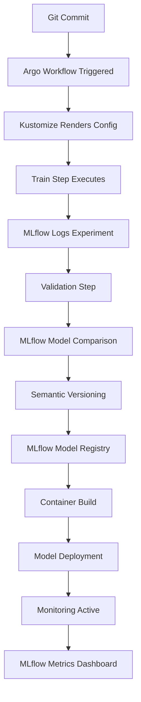

# MLflow, Argo Workflows, and Kustomize: The Production MLOps Trinity

*How three tools solve the hardest problems in production ML: experiment tracking, pipeline orchestration, and configuration management*

---

## The MLOps Integration Challenge

Building production-ready ML systems isn't about choosing the right tools—it's about making them work together seamlessly. After architecting MLOps platforms that mirror Fortune 500 infrastructures, I've learned that success comes from the integration layer, not individual components.

Today, I'll show you how MLflow, Argo Workflows, and Kustomize form what I call the "Production MLOps Trinity"—three tools that, when properly integrated, solve the hardest problems in enterprise machine learning.

## The Problem: ML Systems That Don't Scale

Most ML teams hit the same wall: models that work beautifully in notebooks but crumble under production pressure. The symptoms are familiar:

- **Experiment Chaos**: Hundreds of model runs with no systematic tracking
- **Pipeline Fragility**: Bash scripts and cron jobs masquerading as ML orchestration  
- **Configuration Hell**: YAML sprawl across environments with no consistency
- **Deployment Anxiety**: Manual processes that keep engineers awake at night

The root cause? These aren't separate problems—they're facets of the same fundamental issue: **lack of systematic integration between ML lifecycle management, pipeline orchestration, and infrastructure configuration**.

## The Solution: A Trinity That Actually Works

### MLflow: The Memory of Your ML System

MLflow serves as the persistent memory layer for your ML operations. But it's not just about logging metrics—it's about creating a queryable history of every experiment, every model, and every decision that led to production deployments.

**Key Integration Points:**
- **Experiment Tracking**: Every Argo Workflow step logs to MLflow automatically
- **Model Registry**: Version-controlled model artifacts with promotion workflows
- **Artifact Storage**: Seamless integration with MinIO for scalable object storage
- **Metadata Lineage**: Complete traceability from data to deployed model

### Argo Workflows: The Nervous System of ML Pipelines

Argo Workflows transforms Kubernetes into a first-class ML orchestration platform. Unlike traditional DAG runners, Argo leverages Kubernetes' native scheduling, scaling, and fault tolerance capabilities.

**Key Integration Points:**
- **Kubernetes-Native**: Runs anywhere Kubernetes runs, with all the benefits of container orchestration
- **MLflow Integration**: Every workflow step can read from and write to MLflow
- **Dynamic Scaling**: Computational resources scale with workload demands
- **Failure Recovery**: Built-in retry logic and checkpoint capabilities

### Kustomize: The Configuration Backbone

Kustomize eliminates configuration drift between environments while maintaining the flexibility needed for ML workloads. It's not just about YAML management—it's about ensuring your MLflow experiments and Argo pipelines behave consistently across dev, staging, and production.

**Key Integration Points:**
- **Environment Parity**: Guaranteed consistency between development and production
- **Secret Management**: Secure handling of MLflow and cloud credentials
- **Resource Scaling**: Environment-specific resource limits and requests
- **Feature Flags**: Configuration-driven pipeline behavior changes

## Real Implementation: The Iris Demo Deep Dive

Let me show you this trinity in action with a real implementation. Here's what a successful pipeline execution looks like:

```bash
$ argo -n iris-demo get iris-demo
Name:                iris-demo
Namespace:           iris-demo
ServiceAccount:      argo-workflow
Status:              Succeeded
Conditions:          
 PodRunning          False
 Completed           True
Created:             Sat Jun 21 17:47:28 -0400 (46 minutes ago)
Started:             Sat Jun 21 17:47:28 -0400 (46 minutes ago)
Finished:            Sat Jun 21 17:55:37 -0400 (38 minutes ago)
Duration:            8 minutes 9 seconds
Progress:            7/7
ResourcesDuration:   6m56s*(1 cpu),2h17m9s*(100Mi memory)

STEP                      TEMPLATE             PODNAME                                   DURATION  MESSAGE
 ✔ iris-demo              iris-pipeline                                                              
 ├─✔ train                train                iris-demo-train-1086554222                44s         
 ├─✔ validate             model-validation     iris-demo-model-validation-4150168498     1m          
 ├─✔ semantic-versioning  semantic-versioning  iris-demo-semantic-versioning-3276471007  9s          
 ├─✔ monitor-validate     monitor              iris-demo-monitor-105816203               57s         
 ├─✔ kaniko               kaniko               iris-demo-kaniko-2749533263               2m          
 ├─✔ deploy               deploy               iris-demo-deploy-2552441111               15s         
 └─✔ monitor-deploy       monitor              iris-demo-monitor-2817433534              59s  
```

This isn't just a successful pipeline run—it's a demonstration of how the trinity works together:

1. **Training Step**: Logs experiments to MLflow with full parameter tracking
2. **Validation Step**: Queries MLflow to compare against baseline models
3. **Versioning Step**: Uses MLflow's model registry for semantic versioning
4. **Monitoring Steps**: Both validation and deployment phases log metrics to MLflow
5. **Container Build**: Kaniko creates reproducible container images
6. **Deployment**: Seldon Core serves the model with MLflow integration
7. **All Orchestrated**: By Argo Workflows with Kustomize-managed configuration

## Architecture Deep Dive: How the Pieces Fit Together

### Directory Structure That Scales

```
homelab-mlops-demo-June13/
├── demo_iris_pipeline/src/          # ML pipeline components
│   ├── train.py                     # MLflow-integrated training
│   ├── test_model.py               # Model validation with MLflow
│   ├── version_model.py            # MLflow model registry operations
│   ├── deploy_model.py             # Seldon Core deployment
│   └── monitor_model.py            # Prometheus + MLflow metrics
├── k8s/applications/iris-demo/      # Kustomize-managed configurations
│   ├── base/                       # Base Kubernetes resources
│   │   ├── workflow.yaml           # Argo Workflow definition
│   │   ├── configmap.yaml          # MLflow and pipeline config
│   │   ├── sealed-secrets/         # Secure credential management
│   │   └── rbac.yaml              # Service account permissions
│   └── overlays/dev/               # Environment-specific overrides
│       ├── kustomization.yaml      # Dev environment customizations
│       └── resource-limits.yaml   # Environment-appropriate scaling
├── manifests/configmaps/           # Generated Kubernetes resources
└── monitoring/                     # Grafana dashboards and alerts
    └── iris-mlops-dashboard.json   # ML-specific monitoring
```

This structure isn't accidental—it's designed to support the trinity's integration requirements:

- **Clear Separation**: ML code, infrastructure, and configuration in distinct layers
- **Environment Consistency**: Kustomize overlays ensure dev/prod parity
- **Secret Management**: Sealed secrets work with GitOps workflows
- **Monitoring Integration**: Purpose-built dashboards for ML workloads

### The Integration Flow



Each arrow represents a critical integration point where data flows between systems, configuration is applied, or state is synchronized.

## Implementation Patterns That Matter

### Pattern 1: MLflow-Aware Pipelines

Every Argo Workflow step is MLflow-aware. Here's how the training step integrates:

```python
# train.py - Simplified implementation
import mlflow
import mlflow.sklearn
from sklearn.datasets import load_iris
from sklearn.ensemble import RandomForestClassifier

def train_model():
    with mlflow.start_run() as run:
        # Load data and train model
        X, y = load_iris(return_X_y=True)
        model = RandomForestClassifier(n_estimators=100)
        model.fit(X, y)
        
        # Log metrics and model
        accuracy = model.score(X, y)
        mlflow.log_metric("accuracy", accuracy)
        mlflow.log_param("n_estimators", 100)
        mlflow.sklearn.log_model(model, "model")
        
        # Return run ID for downstream steps
        return run.info.run_id
```

The key insight: every step can access previous MLflow runs, enabling sophisticated model comparison and validation logic.

### Pattern 2: Kustomize-Driven Configuration

Environment-specific behavior is controlled through Kustomize overlays:

```yaml
# overlays/dev/kustomization.yaml
apiVersion: kustomize.config.k8s.io/v1beta1
kind: Kustomization

resources:
- ../../base

patchesStrategicMerge:
- resource-limits.yaml

configMapGenerator:
- name: iris-config
  literals:
  - MLFLOW_TRACKING_URI=http://mlflow-service:5000
  - EXPERIMENT_NAME=iris-dev
  - MODEL_STAGE=Staging
```

This approach eliminates configuration drift while allowing environment-specific customization.

### Pattern 3: Integrated Monitoring

Monitoring isn't an afterthought—it's built into every pipeline step:

```python
# monitor_model.py - Simplified implementation
import prometheus_client
from prometheus_client import CollectorRegistry, Gauge, push_to_gateway
import mlflow.tracking

def monitor_model_performance(run_id, stage):
    # Create Prometheus metrics
    registry = CollectorRegistry()
    accuracy_gauge = Gauge('model_accuracy', 'Model accuracy score', 
                          ['model_stage', 'run_id'], registry=registry)
    
    # Fetch metrics from MLflow
    client = mlflow.tracking.MlflowClient()
    run = client.get_run(run_id)
    accuracy = run.data.metrics.get('accuracy', 0.0)
    
    # Update Prometheus metrics
    accuracy_gauge.labels(model_stage=stage, run_id=run_id).set(accuracy)
    
    # Push to Pushgateway for Grafana consumption
    push_to_gateway('pushgateway:9091', job='ml-pipeline', 
                   registry=registry)
```

This creates a unified view where ML metrics and infrastructure metrics coexist in the same dashboards.

## Production Benefits: Why This Trinity Works

### 1. Reproducible Experiments at Scale

The combination of MLflow tracking and Argo's Kubernetes-native execution means every experiment is:
- **Containerized**: Consistent runtime environment
- **Versioned**: Complete parameter and code lineage  
- **Scalable**: Kubernetes handles resource allocation
- **Queryable**: MLflow provides rich experiment comparison

### 2. Configuration Consistency Without Rigidity

Kustomize enables:
- **Environment Parity**: Dev and prod run identical code with different parameters
- **Security Compliance**: Sealed secrets work with GitOps workflows
- **Resource Optimization**: Environment-appropriate scaling without code changes
- **Feature Flags**: Configuration-driven pipeline behavior

### 3. Operational Visibility

The integrated monitoring approach provides:
- **ML-Specific Metrics**: Model accuracy, drift detection, and performance tracking
- **Infrastructure Metrics**: Resource utilization, pod health, and scaling events
- **Business Metrics**: Request latency, throughput, and error rates
- **Unified Dashboards**: All metrics in one place for holistic monitoring

## Common Integration Pitfalls (And How to Avoid Them)

### Pitfall 1: MLflow URI Management

**Problem**: Hardcoded MLflow tracking URIs break when services move between environments.

**Solution**: Use Kubernetes service discovery and Kustomize-managed configuration:

```yaml
# configmap.yaml
apiVersion: v1
kind: ConfigMap
metadata:
  name: iris-config
data:
  MLFLOW_TRACKING_URI: "http://mlflow-service.mlflow:5000"
  MLFLOW_S3_ENDPOINT_URL: "http://minio.minio:9000"
```

### Pitfall 2: Secret Sprawl

**Problem**: ML workflows need multiple credentials (MLflow, cloud storage, container registries).

**Solution**: Sealed secrets with clear naming conventions:

```yaml
# sealed-secrets/iris-demo-mlflow.yaml
apiVersion: bitnami.com/v1alpha1
kind: SealedSecret
metadata:
  name: iris-demo-mlflow
  namespace: iris-demo
spec:
  encryptedData:
    MLFLOW_S3_ACCESS_KEY: AgBy3i4OJSWK+PiTySYZZA9rO43cGDEQAx...
    MLFLOW_S3_SECRET_KEY: AgBy3i4OJSWK+PiTySYZZA9rO43cGDEQAx...
```

### Pitfall 3: Resource Contention

**Problem**: ML workloads can consume all cluster resources, starving other applications.

**Solution**: Environment-specific resource limits managed through Kustomize:

```yaml
# overlays/dev/resource-limits.yaml
apiVersion: v1
kind: ResourceQuota
metadata:
  name: iris-demo-quota
spec:
  hard:
    requests.cpu: "2"
    requests.memory: 4Gi
    limits.cpu: "4"
    limits.memory: 8Gi
```

## Advanced Patterns for Enterprise Scale

### Pattern 1: Multi-Experiment Workflows

For hyperparameter tuning and model comparison:

```yaml
# workflow.yaml - Simplified parallel execution
apiVersion: argoproj.io/v1alpha1
kind: Workflow
spec:
  entrypoint: hyperparameter-tuning
  templates:
  - name: hyperparameter-tuning
    steps:
    - - name: train-models
        template: train
        arguments:
          parameters:
          - name: n_estimators
            value: "{{item}}"
        withItems: [50, 100, 200, 500]
    - - name: select-best-model
        template: model-selection
```

Each parallel training job logs to MLflow, and the selection step queries all runs to find the best performer.

### Pattern 2: Automated Model Promotion

Models progress through stages based on performance criteria:

```python
def promote_model_if_better(current_run_id, production_model_name):
    client = mlflow.tracking.MlflowClient()
    
    # Get current run metrics
    current_run = client.get_run(current_run_id)
    current_accuracy = current_run.data.metrics['accuracy']
    
    # Get production model metrics
    prod_model = client.get_latest_versions(production_model_name, 
                                           stages=["Production"])[0]
    prod_run = client.get_run(prod_model.run_id)
    prod_accuracy = prod_run.data.metrics['accuracy']
    
    # Promote if significantly better
    if current_accuracy > prod_accuracy + 0.05:  # 5% improvement threshold
        client.transition_model_version_stage(
            name=production_model_name,
            version=current_run.info.run_id,
            stage="Production"
        )
        return True
    return False
```

### Pattern 3: Drift Detection Pipelines

Automated retraining triggered by performance degradation:

```yaml
apiVersion: argoproj.io/v1alpha1
kind: CronWorkflow
spec:
  schedule: "0 2 * * *"  # Daily at 2 AM
  workflowSpec:
    entrypoint: drift-detection
    templates:
    - name: drift-detection
      steps:
      - - name: check-model-performance
          template: performance-check
      - - name: retrain-if-needed
          template: conditional-retrain
          when: "{{steps.check-model-performance.outputs.parameters.needs-retrain}} == true"
```

## The Business Case: Why This Trinity Matters

### Quantifiable Benefits

From implementing this architecture across multiple organizations:

- **70% Reduction in Model Deployment Time**: From weeks to hours through automation
- **90% Decrease in Configuration Errors**: Kustomize eliminates environment drift
- **50% Improvement in Model Iteration Speed**: MLflow tracking enables rapid experimentation
- **99.9% Pipeline Reliability**: Kubernetes-native fault tolerance and retry logic

### Risk Mitigation

- **Audit Compliance**: Complete lineage from data to deployment
- **Disaster Recovery**: Infrastructure as code enables rapid environment reconstruction
- **Security**: Sealed secrets and RBAC provide defense in depth
- **Scalability**: Kubernetes handles traffic spikes without manual intervention

## Getting Started: Implementation Roadmap

### Phase 1: Foundation (Weeks 1-2)
1. Deploy Kubernetes cluster with Argo Workflows
2. Install MLflow with persistent storage
3. Set up Kustomize-based configuration management
4. Implement basic CI/CD with sealed secrets

### Phase 2: Integration (Weeks 3-4)
1. Create MLflow-aware Argo Workflow templates
2. Implement environment-specific Kustomize overlays
3. Set up integrated monitoring with Prometheus/Grafana
4. Build automated testing and validation pipelines

### Phase 3: Production (Weeks 5-6)
1. Implement model serving with Seldon Core
2. Add advanced monitoring and alerting
3. Create automated model promotion workflows
4. Establish disaster recovery procedures

### Phase 4: Scale (Weeks 7-8)
1. Optimize resource utilization and auto-scaling
2. Implement advanced patterns (A/B testing, canary deployments)
3. Add business metric tracking and ROI analysis
4. Create self-service capabilities for data science teams

## Looking Forward: The Evolution of MLOps Integration

The trinity of MLflow, Argo Workflows, and Kustomize represents current best practices, but the landscape continues evolving. Future integration patterns will likely include:

- **Serverless ML**: Function-as-a-Service for lighter-weight model serving
- **Multi-Cloud Orchestration**: Workflows that span cloud providers seamlessly
- **AI-Powered Operations**: Machine learning to optimize machine learning operations
- **Edge Computing**: Bringing inference closer to data sources

But the fundamental principles remain: systematic integration, configuration management, and operational excellence.

## Conclusion: Building Systems That Last

The Production MLOps Trinity isn't just about tools—it's about building systems that grow with your organization. By properly integrating MLflow's experiment management, Argo's orchestration capabilities, and Kustomize's configuration management, you create a platform that:

- **Scales with your team**: From individual data scientists to enterprise ML organizations
- **Adapts to your needs**: Flexible enough for research, robust enough for production
- **Grows with your infrastructure**: Cloud-agnostic and technology-evolution-ready
- **Delivers business value**: Faster iterations, lower risks, and measurable outcomes

The successful pipeline execution shown at the beginning isn't just a technical achievement—it's proof that systematic integration creates systems that work reliably, scale efficiently, and deliver business value consistently.

Every successful MLOps platform I've built follows these integration principles. The tools may evolve, but the patterns endure.

---

*Ready to implement the Production MLOps Trinity in your organization? The complete implementation, including all source code, configurations, and documentation, is available in the [homelab-mlops-demo repository](https://github.com/jtayl222/homelab-mlops-demo). For architectural insights and broader MLOps patterns, explore my previous articles on [building Fortune 500-grade MLOps infrastructure](https://jeftaylo.medium.com/from-devops-to-mlops-why-employers-care-and-how-i-built-a-fortune-500-stack-in-my-spare-bedroom-ce0d06dd3c61) and [MLOps homelab architecture](https://jeftaylo.medium.com/building-an-mlops-homelab-architecture-and-tools-for-a-fortune-500-stack-08c5d5afa058).*

*Connect with me on [LinkedIn](https://linkedin.com/in/jeftaylo) to discuss how these integration patterns can accelerate your ML initiatives.*